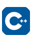

<!-- Replace YOUR_GITHUB_USERNAME, your-linkedin, your-instagram, and your.email@gmail.com -->

  

## About **James**

I'm a curious and enthusiastic Software Engineer who enjoys continuous learning and exploring new technologies, especially AI.

- 🔭 Building web apps and APIs end to end
- 🌱 Currently exploring system design, cloud, and better testing habits
- 💡 I care about clean architecture, readable code, and good developer experience
- 🤝 Open to collaboration, code reviews, and interesting side projects
- ☕ Fueled by coffee, night city views, and a good debugging session

---

## Skills

  

<table align="center">
  <tr>
    <td valign="top" width="150"><h3>Languages</h3></td>
    <td>
      <table>
        <tr>
          <td align="center" width="90">
             JavaScript
          </td>
          <td align="center" width="90">
             TypeScript
          </td>
          <td align="center" width="90">
             Python
          </td>
          <td align="center" width="90">
             Java
          </td>
        </tr>
        <tr>
          <td align="center">
             Go
          </td>
          <td align="center">
             C++
          </td>
          <td align="center">
             HTML
          </td>
          <td align="center">
             CSS
          </td>
        </tr>
      </table>
    </td>
  </tr>
  <tr>
    <td valign="top"><h3>Frontend</h3></td>
    <td>
      <table>
        <tr>
          <td align="center" width="90">
             React
          </td>
          <td align="center" width="90">
             Next.js
          </td>
          <td align="center" width="90">
             Tailwind
          </td>
          <td align="center" width="90">
             Redux
          </td>
        </tr>
      </table>
    </td>
  </tr>
  <tr>
    <td valign="top"><h3>Backend</h3></td>
    <td>
      <table>
        <tr>
          <td align="center" width="90">
             Node.js
          </td>
          <td align="center" width="90">
             Express
          </td>
          <td align="center" width="90">
             GraphQL
          </td>
          <td align="center" width="90">
             PostgreSQL
          </td>
        </tr>
        <tr>
          <td align="center">
             MongoDB
          </td>
          <td align="center">
             Redis
          </td>
        </tr>
      </table>
    </td>
  </tr>
  <tr>
    <td valign="top"><h3>Tools</h3></td>
    <td>
      <table>
        <tr>
          <td align="center" width="90">
             Git
          </td>
          <td align="center" width="90">
             GitHub
          </td>
          <td align="center" width="90">
             Docker
          </td>
          <td align="center" width="90">
             AWS
          </td>
        </tr>
        <tr>
          <td align="center">
             Linux
          </td>
          <td align="center">
             VS Code
          </td>
          <td align="center">
             Figma
          </td>
        </tr>
      </table>
    </td>
  </tr>
</table>
